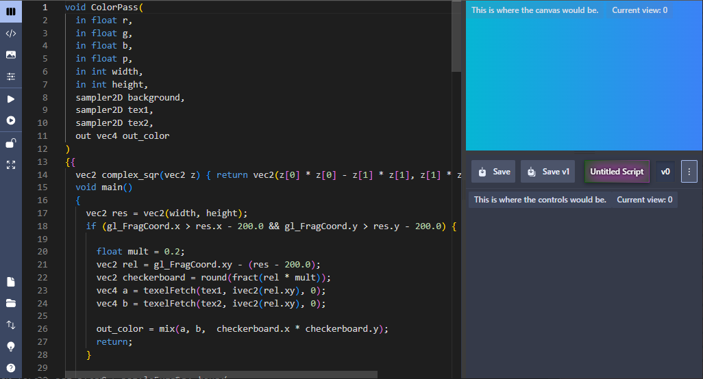

# What is it?

It's a UI template for any kind of specialized code editor that needs a build step, a controls window and an output window. 
It's built on [Sveltekit](https://svelte.dev/), [Skeleton UI toolkit](https://www.skeleton.dev/) and [Monaco Editor](https://microsoft.github.io/monaco-editor/).

[You can preview it here.](https://sam-izdat.github.io/webui-editor-skeleton/)



## What does it do?

### Core features

- cross platform for server and client
- static or dynamic builds with build switch
- local storage adapter for saving code on static builds
- automatically-generated [PWA](https://developer.mozilla.org/en-US/docs/Web/Progressive_web_apps) manifest
- extendable with server storage
- mobile browser support

### UI features

All the actual save/load features are implemented with indexedDB, with LocalStorage fallback. 
You have to bring and connect your own server logic.

- create/update/save/load/delete/search scripts
- create/update per-script versions/revisions
- import and export script files
- import scripts from external URLs
- remappable keyboard shortcuts
- three selectable views with resizable/resettable panes in split view (via [svelte-splitpanes](https://github.com/orefalo/svelte-splitpanes))
- lock editing (e.g. to prevents mobile keyboard from popping up)
- fullscreen
- auto-build toggle
- light and dark mode
- themeable

# Install

## Option 1

Just fork it on GH, rename your fork, and clone that. Then:

```
cd my-forked-webui
npm i
npm run build
```

## Option 2

Either download a release and stick it wherever, then rename it.

Or clone the repo:

```
git clone https://github.com/Sam-Izdat/webui-editor-skeleton.git
```

Then, presumably, you would want to configure and customize it, so:

```
mv webui-editor-skeleton my-app-name
cd my-app-name
rm -rf .git
git init
npm i
npm run build
```

# Configure

Edit the following, for starters:

- `package.json` and fill in your project name/version
- `src/webui.config.js` and fill in your project's details and global configuration options
- replace `static/favicon.ico` and `static/icons/*.*` with your icons
- `src/lib/keymap` to customize keyboard shortcuts


# Develop / build

To develop static build:
```
npm run dev -- --host
```
To develop dynamic server build:
```
npm run dev:server -- --host
```
To build static:
```
npm run build
```
To build dynamic:
```
npm run build:server
```

The variable `__BUILD_TYPE__` will be set to `static` or `server` depending on the above.

# Docs

Maybe later. Almost everything should be fairly self-explanatory, if you poke around the `src` folder.

# Stuff to do

- actually convert everything typescript proper, instead of just sprinkling in type hints occasionally